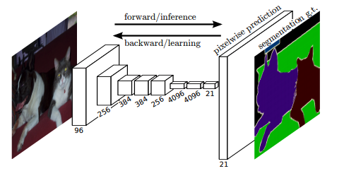
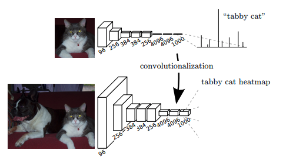
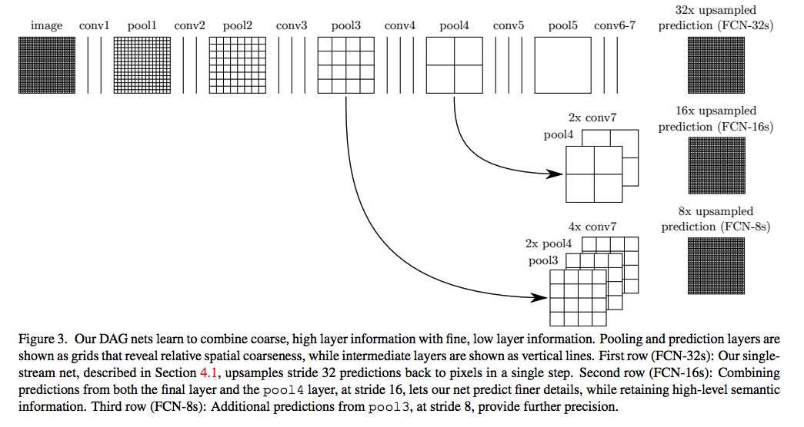
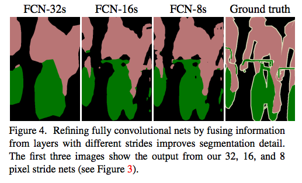
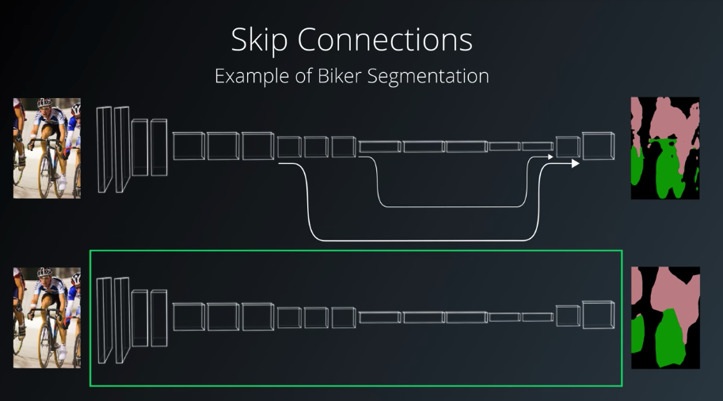

# Semantic Segmentation

Label the pixels of a road in images using a Fully Convolutional Network (FCN).

## Fully Convolutional Networks for Semantic Segmentation

[Paper Link From Berkeley](https://people.eecs.berkeley.edu/~jonlong/long_shelhamer_fcn.pdf)

Semantic segmentation is the task of assigning meaning of part of an object. this can
be done at the pixel level where we assign each pixel to a target class such as road,
car, pedestrian, sign or any number of other classes.

Which Fully convolutional networks can efficiently learn to make dense predictions.


Each layer of data in a convnet is a three-dimensional
array of size h × w × d, where h and w are spatial dimensions,
and d is the feature or channel dimension. The first
layer is the image, with pixel size h × w, and d color channels.


Transforming fully connected layers into convolution
layers enables a classification net to output a heatmap. Adding
layers and a spatial loss (as in Figure 1) produces an efficient machine
for end-to-end dense learning.

### Knowing What and Where





## Implementation in this Project

### Overall Architecture

Image From: [http://cvlab.postech.ac.kr/research/deconvnet](http://cvlab.postech.ac.kr/research/deconvnet/)

### Setup
##### GPU

GPU is necessary for this project.

##### Frameworks and Packages
Make sure you have the following is installed:
 - [Python 3](https://www.python.org/)
 - [TensorFlow >= 1.0](https://www.tensorflow.org/)
 - [NumPy](http://www.numpy.org/)
 - [SciPy](https://www.scipy.org/)
 
##### Dataset
Download the [Kitti Road dataset](http://www.cvlibs.net/datasets/kitti/eval_road.php) from [here](http://www.cvlibs.net/download.php?file=data_road.zip).  Extract the dataset in the `data` folder.  This will create the folder `data_road` with all the training a test images.

### Transfer Learning from [VGG16](https://arxiv.org/abs/1409.1556)

##### Download VGG16 pretrained model
Code will download vgg16 pretraned model under data folder. 

##### Loading Model
On section "Knowing what and where", the paper point out layer3, 4 and 7 are been used 
for up sampling. 

```python
def load_vgg(sess, vgg_path):
    """
    Load Pretrained VGG Model into TensorFlow.
    :param sess: TensorFlow Session
    :param vgg_path: Path to vgg folder, containing "variables/" and "saved_model.pb"
    :return: Tuple of Tensors from VGG model (image_input, keep_prob, layer3_out, layer4_out, layer7_out)
    """
    vgg_tag = 'vgg16'
    vgg_input_tensor_name = 'image_input:0'
    vgg_keep_prob_tensor_name = 'keep_prob:0'
    vgg_layer3_out_tensor_name = 'layer3_out:0'
    vgg_layer4_out_tensor_name = 'layer4_out:0'
    vgg_layer7_out_tensor_name = 'layer7_out:0'

    tf.saved_model.loader.load(sess, [vgg_tag], "./data/vgg")
    graph = tf.get_default_graph()
    image_input = graph.get_tensor_by_name(vgg_input_tensor_name)
    keep = graph.get_tensor_by_name(vgg_keep_prob_tensor_name)
    layer3 = tf.get_default_graph().get_tensor_by_name(vgg_layer3_out_tensor_name)
    layer4 = tf.get_default_graph().get_tensor_by_name(vgg_layer4_out_tensor_name)
    layer7 = tf.get_default_graph().get_tensor_by_name(vgg_layer7_out_tensor_name)
    
    return image_input, keep, layer3, layer4, layer7
```


###### Up Sampling and Skip Connections



```python
def layers(vgg_layer3_out, vgg_layer4_out, vgg_layer7_out, num_classes):
    """
    Create the layers for a fully convolutional network.  Build skip-layers using the vgg layers.
    :param vgg_layer3_out: TF Tensor for VGG Layer 3 output
    :param vgg_layer4_out: TF Tensor for VGG Layer 4 output
    :param vgg_layer7_out: TF Tensor for VGG Layer 7 output
    :param num_classes: Number of classes to classify
    :return: The Tensor for the last layer of output
    """
    layer7_1x1_conv = tf.layers.conv2d(vgg_layer7_out, num_classes, 1,
                                   padding='same',
                                   kernel_initializer=tf.random_normal_initializer(stddev=0.01),
                                   kernel_regularizer=tf.contrib.layers.l2_regularizer(0.001))

    layer7_up_sampling = tf.layers.conv2d_transpose(layer7_1x1_conv, num_classes, 4,
                                             strides=(2, 2),
                                             padding='same',
                                             kernel_initializer=tf.random_normal_initializer(stddev=0.01),
                                             kernel_regularizer=tf.contrib.layers.l2_regularizer(0.001))

    layer4_skip_connection = tf.layers.conv2d(vgg_layer4_out, num_classes, 1,
                                   padding='same',
                                   kernel_initializer=tf.random_normal_initializer(stddev=0.01),
                                   kernel_regularizer=tf.contrib.layers.l2_regularizer(0.001))

    layer8 = tf.add(layer7_up_sampling, layer4_skip_connection)

    layer8_up_sampling = tf.layers.conv2d_transpose(layer8, num_classes, 4,
                                             strides=(2, 2),
                                             padding='same',
                                             kernel_initializer=tf.random_normal_initializer(stddev=0.01),
                                             kernel_regularizer=tf.contrib.layers.l2_regularizer(0.001))
    layer3_skip_connection = tf.layers.conv2d(vgg_layer3_out, num_classes, 1,
                                   padding='same',
                                   kernel_initializer=tf.random_normal_initializer(stddev=0.01),
                                   kernel_regularizer=tf.contrib.layers.l2_regularizer(0.001))
    layer9 = tf.add(layer8_up_sampling, layer3_skip_connection)

    nn_last_layer = tf.layers.conv2d_transpose(layer9, num_classes, 16,
                                               strides=(8, 8),
                                               padding='same',
                                               kernel_initializer=tf.random_normal_initializer(stddev=0.01),
                                               kernel_regularizer=tf.contrib.layers.l2_regularizer(0.001))
    return nn_last_layer
```

##### Run
Run the following command to run the project:
```
python main.py
```
